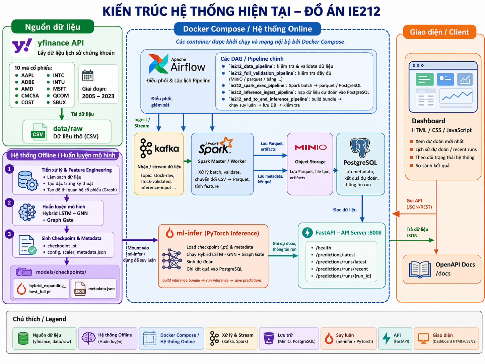

# IE212 - Stock Price Prediction with Local ML Pipeline and Big Data Stack

Project này phục vụ đồ án IE212 với hai phần chính:

1. Huấn luyện và suy luận mô hình dự đoán giá cổ phiếu trên máy local.
2. Đưa pipeline đó vào hệ Big Data gồm PostgreSQL, MinIO, Kafka, Spark, Airflow và FastAPI dashboard.

README này ưu tiên một mục tiêu: clone repo về rồi chạy được từng bước, không phụ thuộc vào những file đang bị `.gitignore`.

## System Architecture



## Repo đang track gì và không track gì

Những thứ sau đây được tạo ra trong lúc chạy và hiện không commit vào Git:

- `data/raw/`: CSV cổ phiếu tải về từ `yfinance`
- `data/processed/`: dữ liệu xử lý trung gian
- `models/`: checkpoint `.pt`
- `services/spark/out/`: output Spark local
- `airflow/logs/`: log runtime
- một số file kết quả trong `outputs/`

Điều này có nghĩa là:

- clone mới sẽ chưa có checkpoint trong `models/`
- clone mới sẽ chưa có dữ liệu raw trong `data/raw/`
- muốn chạy inference thật thì phải train trước để sinh checkpoint
- muốn chạy Docker stack thì phải tạo `compose/.env` từ file mẫu

## Cấu trúc thư mục quan trọng

```text
IE212/
|-- airflow/                  # Dockerfile + DAG Airflow
|-- compose/                  # Docker Compose và env mẫu
|-- data/
|   |-- inference/            # bundle .npz cho inference
|   |-- raw/                  # CSV raw sinh ra sau khi chạy local pipeline
|   `-- processed/            # dữ liệu xử lý trung gian
|-- img/
|   `-- system_architecture.png
|-- models/                   # checkpoint sinh ra sau khi train
|-- outputs/                  # metrics, predictions, báo cáo thực thi
|-- scripts/                  # entry points để train / infer / save DB
|-- services/
|   |-- api/                  # FastAPI + dashboard
|   |-- inference/            # Docker image cho ML runner
|   `-- spark/                # Spark jobs và output
|-- src/                      # code ML core
|-- .gitignore
|-- README.md
`-- requirements.txt
```

## Yêu cầu trước khi chạy

- Windows PowerShell
- Python 3.11
- Docker Desktop
- Git

## 1. Clone project

```powershell
git clone <repo-url>
cd ie212
```

## 2. Tạo môi trường Python

```powershell
python -m venv .venv
.\.venv\Scripts\Activate.ps1
python -m pip install --upgrade pip
pip install -r requirements.txt
```

Gói `psycopg2-binary` đã nằm trong `requirements.txt`, nên sau bước này các script local có ghi dữ liệu vào PostgreSQL sẽ chạy được luôn.

## 3. Chạy local ML pipeline từ đầu

### Bước 3.1 - Tải dữ liệu raw về `data/raw/`

Lệnh này tải dữ liệu theo danh sách ticker trong `src/config.py`.

```powershell
python scripts/run_train.py
```

Hành vi hiện tại của lệnh này:

- nếu `data/raw/<TICKER>.csv` đã có thì script sẽ ưu tiên dùng lại file local
- nếu chưa có thì script mới thử tải từ `yfinance`
- nếu muốn ép tải lại toàn bộ, dùng `python scripts/run_train.py --refresh`

Sau khi chạy xong, bạn sẽ thấy các file như:

- `data/raw/AAPL.csv`
- `data/raw/MSFT.csv`
- ...

### Bước 3.2 - Train experiment và sinh checkpoint

Lệnh này là bước quan trọng nhất vì nó tạo ra checkpoint trong `models/`.

```powershell
python scripts/run_experiment.py
```

Kết quả mong đợi:

- `models/lstm_expanding_best_full.pt`
- `models/hybrid_expanding_best_full.pt`
- `models/run_metadata_full.json`
- `outputs/metrics_full.json`
- các file CSV kết quả trong `outputs/`

### Bước 3.3 - Build inference bundle

```powershell
python scripts/build_latest_inference_bundle.py --data-dir data/raw --output data/inference/latest_window.npz
```

Kết quả:

- `data/inference/latest_window.npz`

### Bước 3.4 - Chạy inference từ checkpoint

```powershell
python scripts/run_checkpoint_inference.py --checkpoint models/hybrid_expanding_best_full.pt --input-npz data/inference/latest_window.npz --output-json outputs/inference/latest_prediction.json
```

Kết quả:

- `outputs/inference/latest_prediction.json`

### Bước 3.5 - Kiểm tra checkpoint nếu cần

```powershell
python scripts/inspect_checkpoint.py --checkpoint models/hybrid_expanding_best_full.pt
```

## 4. Chạy Big Data stack bằng Docker

### Bước 4.1 - Tạo file env cho Docker Compose

`compose/.env` đang bị ignore, nên clone mới sẽ không có file này. Tạo nó từ file mẫu:

```powershell
Copy-Item compose\.env.example compose\.env
```

Nếu cần, sửa password/port trong `compose/.env`.

### Bước 4.2 - Build Airflow image local

`compose/compose.yaml` đang dùng image `ie212-airflow-custom:local`, nên phải build trước:

```powershell
docker build -t ie212-airflow-custom:local -f airflow/Dockerfile .
```

### Bước 4.3 - Start toàn bộ stack

```powershell
docker compose --env-file compose/.env -f compose/compose.yaml up -d --build
```

Các service chính:

- PostgreSQL: `localhost:15432`
- MinIO API: `http://localhost:9000`
- MinIO Console: `http://localhost:9001`
- Kafka host port: `localhost:29092`
- Spark Master UI: `http://localhost:8080`
- Spark Worker UI: `http://localhost:8081`
- Airflow UI: `http://localhost:8088`
- FastAPI docs: `http://localhost:8008/docs`
- Dashboard: `http://localhost:8008/dashboard`

### Bước 4.4 - Đưa kết quả inference vào PostgreSQL

Sau khi đã có `outputs/inference/latest_prediction.json`, bạn có thể lưu prediction vào database:

```powershell
python scripts/save_inference_to_postgres.py --input-json outputs/inference/latest_prediction.json --pg-host localhost --pg-port 15432 --pg-db stock_project --pg-user stock_user --pg-password change_me_postgres
```

Nếu máy host của bạn vẫn có xung đột khi gọi PostgreSQL qua `localhost`, có thể chạy trực tiếp trong container ML runner:

```powershell
docker exec ie212-ml-infer python scripts/save_inference_to_postgres.py --input-json outputs/inference/latest_prediction.json --pg-host postgres --pg-port 5432 --pg-db stock_project --pg-user stock_user --pg-password change_me_postgres
```

### Bước 4.5 - Xem dashboard

Mở:

- `http://localhost:8008/dashboard`
- `http://localhost:8008/docs`

## 5. Luồng chạy nhanh nhất để demo lại từ đầu

Nếu bạn chỉ cần chạy lại local pipeline:

```powershell
.\.venv\Scripts\Activate.ps1
python scripts/run_train.py
python scripts/run_experiment.py
python scripts/build_latest_inference_bundle.py --data-dir data/raw --output data/inference/latest_window.npz
python scripts/run_checkpoint_inference.py --checkpoint models/hybrid_expanding_best_full.pt --input-npz data/inference/latest_window.npz --output-json outputs/inference/latest_prediction.json
```

Nếu bạn cần cả dashboard:

```powershell
Copy-Item compose\.env.example compose\.env
docker build -t ie212-airflow-custom:local -f airflow/Dockerfile .
docker compose --env-file compose/.env -f compose/compose.yaml up -d --build
python scripts/save_inference_to_postgres.py --input-json outputs/inference/latest_prediction.json --pg-host localhost --pg-port 15432 --pg-db stock_project --pg-user stock_user --pg-password change_me_postgres
```

## 6. Một lệnh để reset và chạy lại từ đầu

Script reset mới:

```powershell
powershell -ExecutionPolicy Bypass -File .\scripts\reset_workspace.ps1
```

Lệnh này sẽ:

- `docker compose down -v --remove-orphans` nếu máy có Docker
- xóa `data/raw/`, `data/processed/`, `models/`
- xóa `services/spark/out/`, `airflow/logs/`
- xóa inference bundle và các output đã generate
- xóa toàn bộ `__pycache__`

Nếu muốn xóa luôn môi trường `.venv`:

```powershell
powershell -ExecutionPolicy Bypass -File .\scripts\reset_workspace.ps1 -RemoveVenv
```

Sau đó bạn chạy lại từ Bước 2.

## 7. Thứ tự nên dùng khi chấm/demo

1. Clone repo.
2. Tạo `.venv` và cài `requirements.txt`.
3. Chạy `python scripts/run_train.py`.
4. Chạy `python scripts/run_experiment.py`.
5. Chạy `python scripts/build_latest_inference_bundle.py`.
6. Chạy `python scripts/run_checkpoint_inference.py`.
7. Tạo `compose/.env` từ `compose/.env.example`.
8. Build Airflow image.
9. Start Docker stack.
10. Chạy `python scripts/save_inference_to_postgres.py --pg-port 15432`.
11. Mở dashboard và docs.

## 8. Ghi chú quan trọng

- Nếu chưa chạy `scripts/run_experiment.py` thì sẽ chưa có `models/hybrid_expanding_best_full.pt`.
- Nếu chưa có `data/raw/*.csv` thì `build_latest_inference_bundle.py` sẽ không chạy được.
- `compose/.env` không được commit, nên luôn tạo từ `compose/.env.example`.
- Cổng PostgreSQL publish ra host là `15432`; cổng `5432` chỉ dùng nội bộ giữa các container.
- File `services/api/main.py` đọc lịch sử giá từ `data/raw/`, nên dashboard cần raw CSV tồn tại nếu muốn xem price history.
