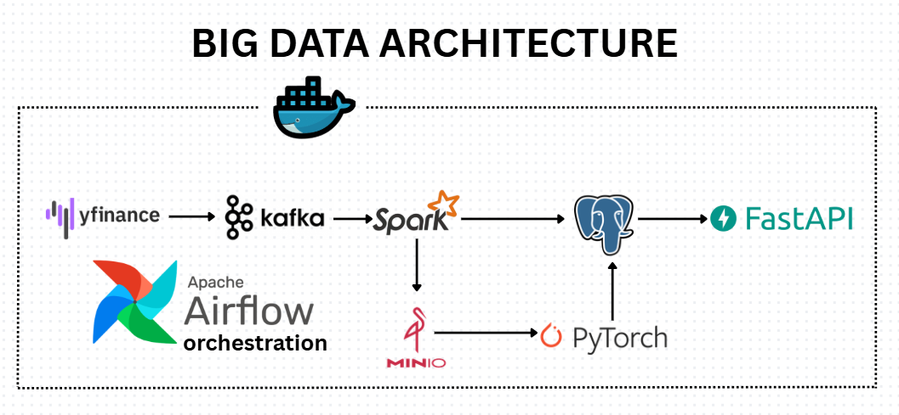

# Hệ Thống Dự Báo Giá Đóng Cửa Cổ Phiếu - IE212

Hệ thống thu thập, xử lý trực tuyến và dự báo giá cổ phiếu thời gian thực sử dụng kiến trúc Big Data kết hợp mô hình học sâu **LSTM-GNN (Graph-Gate)**.



---

## 1. Kiến Trúc Hệ Thống & Luồng Dữ Liệu
Kiến trúc gồm 5 lớp xử lý Big Data tiêu chuẩn:
1. **Nguồn Dữ Liệu**: Kéo dữ liệu lịch sử tự động (`yfinance`) hoặc đọc dữ liệu CSV từ thư mục `data/raw/`.
2. **Ingestion Layer (Kafka)**: Dịch vụ `stock-producer` đẩy luồng giá cổ phiếu liên tục vào Kafka topic `stock-price`.
3. **Big Data Processing Layer (Spark)**: Spark Streaming tiêu thụ dữ liệu từ Kafka, xử lý trực tuyến và ghi đồng thời vào PostgreSQL (`stock.kafka_ticks_batch`) và định dạng Parquet.
4. **Object Storage Layer (MinIO)**: Parquet được đồng bộ lên MinIO làm đầu vào lưu trữ phân tán cho quá trình dự báo.
5. **Inference & Serving Layer (PyTorch + FastAPI + TradingView)**:
   - Dựng bundle `.npz` từ Parquet trong MinIO.
   - Chạy mô hình lai **LSTM-GNN (Graph-Gate)** bằng PyTorch để sinh dự đoán giá đóng cửa tiếp theo, lưu vào PostgreSQL.
   - **FastAPI Backend** phục vụ API và Dashboard thời gian thực sử dụng **TradingView Lightweight Charts** (biểu đồ đường & nến Nhật/thể tích).
   - **Trợ lý AI trực tuyến**: Phân tích chi tiết động từ Gemini API theo yêu cầu cho từng mã dựa trên 9 chỉ số hiệu năng chiến lược tài chính.

---

## 2. Cách khởi chạy dự án

Để hỗ trợ chạy thử nghiệm nhanh chóng nhất cho người dùng mới mà không phải gõ hàng tá lệnh phức tạp, dự án cung cấp tệp điều phối tự động **`main.py`** tại thư mục gốc.

### Yêu cầu trước khi chạy:
- Đã cài đặt **Docker / Docker Desktop** và phần mềm đang chạy.
- Đã cài đặt **NodeJS/NPM** (để chạy Frontend React cục bộ nếu có).
- *(Tùy chọn)* Cấu hình `GEMINI_API_KEY` trong file `compose/.env` để kích hoạt Trợ lý AI thực tế từ Google.

### Chạy duy nhất MỘT lệnh tại Terminal:
```bash
python main.py
```

**Mã nguồn `main.py` sẽ tự động thực hiện:**
1. Tạo môi trường ảo `.venv` và tự động cài đặt toàn bộ `requirements.txt`.
2. Tự tải dữ liệu chứng khoán lịch sử và huấn luyện mô hình local để lấy file checkpoint `.pt`.
3. Khởi dựng Docker Stack (build image, compose up, khởi tạo Database).
4. Tự động nạp sẵn dữ liệu dự báo mẫu của 10 cổ phiếu chất lượng vào PostgreSQL để tránh lỗi degraded khi stack vừa chạy.
5. Cài đặt node packages và tự động chạy luồng Frontend React cục bộ (`npm run dev`).

---

## 3. Các Địa Chỉ Giao Diện Hệ Thống (UIs)
Sau khi stack khởi chạy thành công, bạn có thể truy cập các dịch vụ:
- **FastAPI / Dashboard chính**: [http://localhost:8008/dashboard](http://localhost:8008/dashboard) (Giao diện Tiếng Việt 100%, tích hợp Đồ thị TradingView và Trợ lý AI).
- **Airflow UI**: [http://localhost:8088](http://localhost:8088) (Đăng nhập bằng tài khoản lấy từ `docker exec ie212-airflow-apiserver cat /opt/airflow/simple_auth_manager_passwords.json.generated`).
- **Spark Master UI**: [http://localhost:8080](http://localhost:8080)
- **MinIO Console**: [http://localhost:9001](http://localhost:9001) (Tài khoản: `minioadmin` / `change_me_minio`).
- **Tài liệu API**: [http://localhost:8008/docs](http://localhost:8008/docs)

---

## 4. Chạy Thủ Công & Demo Thực Tế

1. **Bước 1: Chạy luồng Kafka Stock Producer cục bộ** để đẩy dữ liệu online:
   ```bash
   .venv/Scripts/activate # Kích hoạt môi trường ảo
   python scripts/publish_stock_ticks.py --bootstrap-servers localhost:29092 --source csv --max-iterations 1
   ```

2. **Bước 2: Kích hoạt chạy DAG trên Airflow**:
   - Mở Airflow UI tại [http://localhost:8088](http://localhost:8088).
   - Bật và trigger DAG **`ie212_kafka_to_inference_pipeline`**.
   - DAG này sẽ tự động chạy Spark tiêu thụ dữ liệu từ Kafka -> ghi Parquet -> đưa lên MinIO -> chạy mô hình dự báo PyTorch -> Ghi kết quả mới vào PostgreSQL.
   - Khi DAG báo xanh (Success), Dashboard tại port `8008` sẽ cập nhật giá dự báo và khuyến nghị mới ngay lập tức!

---

## 5. Dọn Dẹp Không Gian Làm Việc (Reset Workspace)
Để xóa bỏ toàn bộ log, dữ liệu rác, và dừng docker stack sạch sẽ:
```powershell
powershell -ExecutionPolicy Bypass -File .\scripts\reset_workspace.ps1
```

*Sản phẩm demo cho môn học Công Nghệ Dữ Liệu Lớn (IE212) | Bản quyền thuộc về Đạt - Cường - An.*
